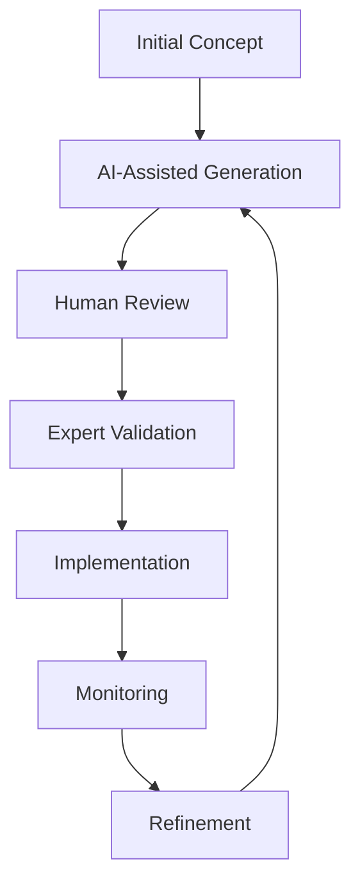

# Discussion with CEO, Freecodecamp

The integration of Gen AI into professional practice requires a nuanced understanding that balances innovation with fundamental skills. While these tools offer unprecedented capabilities for automation and assistance, their effective use demands a foundation of traditional knowledge and critical thinking. The key to success lies not in wholesale adoption or rejection, but in thoughtful integration that enhances rather than replaces human expertise.

### Fundamental Principles Matrix

| Aspect | Traditional Approach | Gen AI Enhancement | Optimal Integration |
|--------|---------------------|-------------------|-------------------|
| Learning | Sequential skill building | Rapid prototyping | Hybrid approach with validation |
| Development | Manual coding/creation | AI-assisted generation | Human-guided automation |
| Quality Control | Expert review | Automated checks | Multi-layer verification |
| Knowledge Base | Deep domain expertise | Broad data access | Synthesized understanding |

## Practical Implementation Strategies

The implementation of Gen AI tools should follow a structured approach that maintains quality while leveraging technological advantages:

1. Knowledge Foundation
   - Mastery of fundamental concepts
   - Understanding of underlying principles
   - Regular skill practice and development
   - Continuous learning approach

2. Tool Integration
   - Targeted use for specific tasks
   - Quality validation processes
   - Performance monitoring
   - Regular effectiveness assessment

### Detailed Implementation Framework

```
Phase 1: Foundation Building
├── Core skill development
├── Technical understanding
├── Critical thinking enhancement
└── Problem-solving practice

Phase 2: Tool Integration
├── Selective implementation
├── Process validation
├── Performance monitoring
└── Quality assurance

Phase 3: Optimization
├── Efficiency improvement
├── Process refinement
├── Capability expansion
└── Continuous assessment
```

## Real-World Applications and Considerations

### Language Learning Implementation

The application of Gen AI in language learning demonstrates both the potential and limitations of current technology. While AI provides unlimited practice opportunities and patient interaction, it serves best as a complement to traditional learning methods rather than a replacement. This model applies broadly to other domains:

#### Key Implementation Points
- Unlimited practice opportunities
- Consistent availability
- Customizable learning pace
- Expert validation requirement
- Integration with traditional methods

### Development and Creation Process

In software development and content creation, Gen AI serves as a powerful assistant while requiring human oversight:



## Strategic Considerations

### Cost-Benefit Analysis Table

| Factor | Benefits | Risks | Mitigation Strategies |
|--------|----------|-------|---------------------|
| Tool Dependency | Rapid development | Vendor lock-in | Open source alternatives |
| Skill Development | Efficiency gains | Fundamental erosion | Balanced learning approach |
| Quality Control | Automated checks | Oversight gaps | Multi-layer validation |
| Cost Management | Initial savings | Long-term expenses | Strategic planning |

### Long-term Sustainability

The sustainable implementation of Gen AI requires careful consideration of several key factors:

1. Independence and Control
   - Tool ownership considerations
   - Data control and privacy
   - Process autonomy
   - Technical sovereignty

2. Skill Maintenance
   - Continuous learning
   - Fundamental practice
   - Technical proficiency
   - Critical evaluation

## Risk Management and Mitigation

### Primary Risk Categories

1. Technical Risks
   - Tool dependency
   - Quality assurance
   - Performance stability
   - Integration challenges

2. Business Risks
   - Cost escalation
   - Vendor lock-in
   - Skill degradation
   - Market changes

### Mitigation Strategies

A comprehensive approach to risk management should include:

```
1. Technical Independence
   - Open source alternatives
   - Multiple tool proficiency
   - Internal capability development
   - Regular skill assessment

2. Quality Assurance
   - Validation processes
   - Expert review protocols
   - Performance monitoring
   - Regular audits

3. Cost Control
   - Usage optimization
   - Alternative evaluation
   - Efficiency monitoring
   - Resource planning
```

## Future Considerations and Planning

### Technology Evolution Matrix

| Aspect | Current State | Near Future | Long-term Outlook |
|--------|--------------|-------------|-------------------|
| Tool Capability | Basic automation | Enhanced intelligence | Comprehensive solutions |
| Skill Requirements | Fundamental knowledge | Hybrid expertise | Advanced integration |
| Market Dynamic | Rapid change | Consolidation | Standardization |
| Cost Structure | Variable | Stabilizing | Optimized |

### Strategic Planning Framework

Long-term success with Gen AI requires:

1. Adaptive Strategy
   - Regular assessment
   - Flexible implementation
   - Continuous learning
   - Technology monitoring

2. Skill Development
   - Core competency maintenance
   - Tool proficiency
   - Critical thinking
   - Problem-solving

## Conclusion

The effective implementation of Gen AI requires a balanced approach that values fundamental skills while leveraging technological advantages. Success comes through:

- Maintaining strong foundational knowledge
- Implementing thoughtful tool integration
- Ensuring quality through validation
- Planning for long-term sustainability
- Adapting to technological evolution

This approach enables organizations and individuals to benefit from Gen AI capabilities while maintaining independence and quality control. The focus should remain on sustainable growth and development rather than short-term efficiency gains.