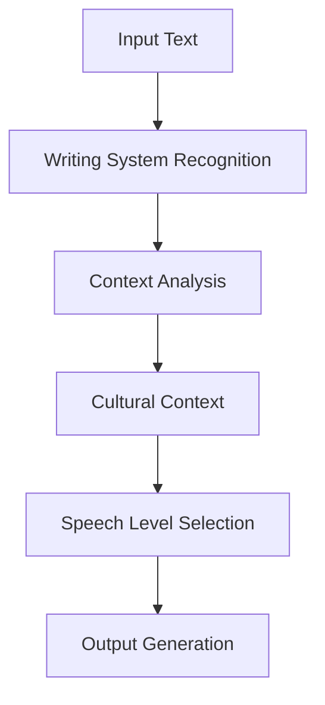

# Japan!

## Writing Systems Overview

### Core Writing Systems Matrix

| System | Purpose | Characteristics | Usage Context |
|--------|----------|----------------|----------------|
| Hiragana | Native Japanese words | Phonetic syllabary | Basic writing, grammar |
| Katakana | Foreign loanwords | Phonetic syllabary | Foreign terms, emphasis |
| Kanji | Ideographic characters | Chinese-derived | Core vocabulary, concepts |
| Romaji | Latin alphabet representation | Phonetic conversion | International usage |
| Emoji | Graphical expression | Supplementary | Digital communication |

### Kanji Complexity

1. Reading Variations:
   - On'yomi (Chinese-derived readings)
   - Kun'yomi (Japanese native readings)
   - Context-dependent pronunciation
   - Multiple possible readings per character

2. Usage Patterns:
   - Individual usage (typically kun'yomi)
   - Compound words (typically on'yomi)
   - Mixed readings in compounds
   - Contextual variations

## Structural Features

### Sentence Construction
```
Japanese Structure:
[Subject] [Object] [Verb]

English Structure:
[Subject] [Verb] [Object]

Example:
私は公園で写真を撮りたい
(I at-park photos take want)
"I want to take photos at the park"
```

### Particle System

Particles serve as grammatical markers:

| Particle | Function | Example Usage |
|----------|----------|---------------|
| は (wa) | Topic marker | 私は (I - topic) |
| を (wo) | Object marker | 写真を (photos - object) |
| に (ni) | Direction/target | 公園に (to park) |
| で (de) | Location/means | 公園で (at park) |
| の (no) | Possession | 私の (my) |

## Language Complexities

### Homophone Management
1. Context Dependence:
   - Multiple meanings for same sound
   - Context-based disambiguation
   - Kanji differentiation in writing
   - Listening comprehension importance

Example: こう (kō)
```
高 - high/tall
考 - think
校 - school
行 - go
```

### Speech Levels

| Level | Usage | Context | Example |
|-------|--------|---------|---------|
| Casual | Friends, family | Informal settings | 写真撮る |
| Polite | General use | Business, strangers | 写真撮ります |
| Honorific | Respecting others | Customers, seniors | お写真お撮りになります |
| Humble | Self-reference | Business, formal | 写真撮らせていただきます |

## Gen AI Implementation Challenges

### 1. Text Processing
- Multiple writing system handling
- Character conversion accuracy
- Context-aware reading selection
- Proper particle usage

### 2. Natural Language Understanding
- Context dependency
- Speech level appropriateness
- Cultural nuance recognition
- Homophone disambiguation

### 3. Translation Considerations


### 4. System Requirements

| Component | Requirement | Purpose |
|-----------|-------------|---------|
| Text Processing | Multi-script support | Handle all writing systems |
| Context Engine | Cultural awareness | Appropriate speech levels |
| Grammar Engine | Particle management | Correct sentence structure |
| Translation Engine | Nuance preservation | Maintain meaning accuracy |

## Best Practices for Implementation

### 1. Text Processing
- Implement robust character recognition
- Handle multiple writing systems
- Support character conversion
- Maintain formatting integrity

### 2. Context Management
- Analyze social context
- Determine appropriate speech levels
- Consider cultural implications
- Preserve linguistic nuances

### 3. Quality Assurance
- Native speaker validation
- Context verification
- Cultural appropriateness check
- Technical accuracy verification

## Practical Considerations

### Development Approach
1. Base Requirements:
   - Multi-script text handling
   - Context analysis capability
   - Speech level management
   - Cultural awareness

2. Implementation Steps:
   - Character recognition system
   - Context analysis engine
   - Grammar verification
   - Output validation

### Common Challenges
1. Technical Issues:
   - Character encoding
   - Font rendering
   - Input method support
   - System integration

2. Linguistic Challenges:
   - Context interpretation
   - Speech level selection
   - Particle usage
   - Homophone disambiguation

## Conclusion

The implementation of Gen AI systems for Japanese language processing requires careful consideration of multiple writing systems, complex grammar structures, and cultural contexts. Success depends on:

- Robust multi-script handling
- Accurate context interpretation
- Appropriate speech level selection
- Cultural awareness integration
- Comprehensive quality assurance

A balanced approach considering both technical capabilities and linguistic nuances is essential for effective implementation.