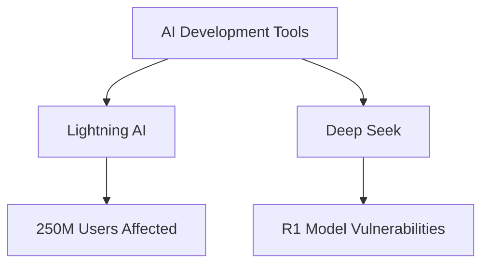

# H-ASHish

## Executive Summary

In the rapidly evolving landscape of Gen AI adoption, organizations face three critical security challenges:
1. Data protection in LLM interactions
2. Code assistant reliability and verification
3. AI development environment security

## Core Security Vulnerabilities

### 1. Data Protection ("Keys at the Door")

| Risk Area | Impact | Example Scenario |
|-----------|---------|-----------------|
| Sensitive Data Exposure | Data leakage to third parties | PII sent to external LLMs |
| Model Data Collection | Unauthorized data gathering | Deep Seek's China data center issue |
| Compliance Violations | Regulatory breaches | Non-compliant data processing |

#### Protection Strategies:
```
1. Data Handling
   ├── Data Classification
   ├── Masking Implementation
   ├── Tokenization
   └── De-identification

2. Model Verification
   ├── Provider Assessment
   ├── Compliance Check
   ├── Data Flow Analysis
   └── Security Audit
```

### 2. Code Assistant Security ("Ocean Safety")

#### Risk Assessment Matrix

| Risk Level | Developer Experience | Mitigation Required |
|------------|---------------------|-------------------|
| High | Junior Developers | Restrict access, require review |
| Medium | Mid-level Developers | Mandatory code review |
| Lower | Senior Developers | Standard review process |

#### Implementation Guidelines:
1. Access Control:
   - Limit to experienced developers
   - Implement review protocols
   - Establish usage guidelines
   - Monitor implementation

2. Code Verification:
   - Security review process
   - Quality assurance checks
   - Performance validation
   - Compliance verification

### 3. Development Environment ("Studio Security")

#### Known Vulnerabilities:


#### Security Measures:
1. Tool Assessment:
   - Vulnerability scanning
   - Security updates
   - Patch management
   - Version control

2. Environment Protection:
   - Access controls
   - Network security
   - Data encryption
   - Monitoring systems

## Implementation Framework

### 1. Foundation Building

| Component | Requirement | Implementation |
|-----------|-------------|----------------|
| Education | Team training | Security awareness programs |
| Controls | Security measures | Access and monitoring systems |
| Monitoring | Ongoing surveillance | Security update tracking |
| Response | Incident handling | Security incident procedures |

### 2. Best Practices

#### Data Protection:
- Implement data classification
- Use masking/tokenization
- Verify model compliance
- Monitor data flows

#### Code Security:
- Restrict assistant access
- Implement review processes
- Verify output quality
- Document usage guidelines

#### Environment Security:
- Regular security updates
- Vulnerability monitoring
- Access control implementation
- Security patch management

## Risk Mitigation Strategy

### 1. Immediate Actions
- Assess current Gen AI usage
- Identify sensitive data
- Implement protection measures
- Establish monitoring

### 2. Ongoing Management
- Security update tracking
- Team education
- Compliance monitoring
- Tool assessment

### 3. Future Planning
- Technology evolution monitoring
- Security requirement updates
- Tool evaluation process
- Compliance verification

## Practical Implementation Steps

### Phase 1: Assessment
1. Current State Analysis:
   - Tool inventory
   - Usage patterns
   - Risk assessment
   - Compliance check

2. Gap Identification:
   - Security weaknesses
   - Process improvements
   - Training needs
   - Control requirements

### Phase 2: Implementation
1. Security Controls:
   - Access management
   - Data protection
   - Monitoring systems
   - Review processes

2. Team Preparation:
   - Security training
   - Usage guidelines
   - Review procedures
   - Incident response

## Conclusion

Successful Gen AI security implementation requires:
- Clear understanding of vulnerabilities
- Comprehensive protection strategies
- Regular monitoring and updates
- Team education and awareness
- Continuous security assessment

Organizations should maintain vigilance as AI technology evolves, ensuring security measures adapt to new challenges while enabling productive use of Gen AI capabilities.