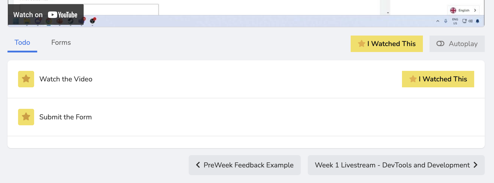

# DaGenAI Preweek Submission

### Location Access
1. ExamPro Platform:
   - Navigate to pre-week section
   - Locate submission form
   - Fill out required fields
   - Provide GitHub links


The last video of the section, click it.



Go a bit down and you will see form click it and submit the needed.

### Repository Organization
```
github_repository/
├── gen_architecting/
│   └── [architectural diagrams and documentation]
└── sentence_constructor/
    └── [implementation files and documentation]
```

## Documentation Requirements

### Project Links
- GitHub repository links required
- Maintain standard folder names:
  - `gen_architecting`
  - `sentence_constructor`
- Ensure correct folder structure

### Technical Documentation Components

#### 1. Hypothesis Documentation
Example format:
```markdown
Initial Assumptions:
- Meta AI capability limitations
- Paid tier requirements
- Platform performance expectations
```

#### 2. Technical Uncertainty
Exploration areas:
- Model capabilities
- Platform limitations
- Integration challenges
- Performance metrics

#### 3. Technical Exploration
Implementation steps:
1. Meta AI Implementation:
   - Initial prompt development
   - Performance testing
   - Capability assessment

2. ChatGPT Integration:
   - GPT-4 implementation
   - Mini model testing
   - Performance comparison

3. Claude Development:
   - Sonnet 3.5 implementation
   - Paid tier utilization
   - Resource monitoring

#### 4. Final Outcomes
Documentation format:
```markdown
Key Findings:
1. Model Performance:
   - Meta AI: 70B parameter model, exceeded expectations
   - ChatGPT: Adequate but verbose
   - Claude: Best output, higher cost

2. Implementation Insights:
   - Cross-platform compatibility
   - Prompt optimization
   - Resource utilization
```

## Example Documentation

### Hypothesis Example
```markdown
Initial Assumptions:
1. Model Capabilities:
   - Meta AI insufficient for complex tasks
   - Paid tiers required for optimal performance
   - Claude expected to provide best results

2. Implementation Requirements:
   - Platform-specific optimizations needed
   - Resource usage considerations
   - Performance variations expected
```

### Technical Exploration Example
```markdown
Development Process:
1. Platform Testing:
   - Meta AI: GPT-4, 70B parameters
   - ChatGPT: GPT-4, Paid tier
   - Claude: Sonnet 3.5, Paid version

2. Implementation Steps:
   - Incremental prompt development
   - Cross-platform testing
   - Performance optimization
```

### Final Outcomes Example
```markdown
Key Findings:
1. Performance Analysis:
   - Meta AI: Surprisingly effective, 70B parameter model
   - ChatGPT Mini: Limited effectiveness
   - GPT-4: Good but verbose
   - Claude: Optimal output, higher cost

2. Implementation Insights:
   - Common prompt structure effective
   - Claude-specific optimizations beneficial
   - Resource monitoring crucial
```

## Submission Guidelines

### Best Practices
1. Documentation Quality:
   - Clear hypothesis statements
   - Detailed technical exploration
   - Comprehensive outcomes
   - Specific platform details

2. Format Requirements:
   - Proper folder structure
   - Consistent naming
   - Complete documentation
   - Accurate links

### Important Considerations
1. Submission Process:
   - Draft option available
   - Final submission permanent
   - No post-submission edits
   - Careful review required

2. Evaluation Focus:
   - Early weeks: Sample review
   - Later weeks: Comprehensive assessment
   - Progressive participation
   - Quality documentation

## Submission Checklist

Before submitting:
- [ ] GitHub links verified
- [ ] Folder names correct
- [ ] Documentation complete
- [ ] Hypothesis documented
- [ ] Technical exploration detailed
- [ ] Outcomes documented
- [ ] Format reviewed
- [ ] Content accuracy checked


After submitting:
- [x] GitHub links verified
- [x] Folder names correct
- [x] Documentation complete
- [x] Hypothesis documented
- [x] Technical exploration detailed
- [x] Outcomes documented
- [x] Format reviewed
- [x] Content accuracy checked

## Final Notes

Success factors include:
- Clear documentation
- Proper organization
- Detailed analysis
- Accurate reporting
- Careful submission

Remember:
- Submissions are permanent
- Draft option available
- Follow naming conventions
- Maintain documentation quality
- Learn from example reviews


I submitted the following for my first preweek of the bootcamp

> [This one](MIT.md).

> a PDF [as such](TeacherSeat-Materials.pdf).