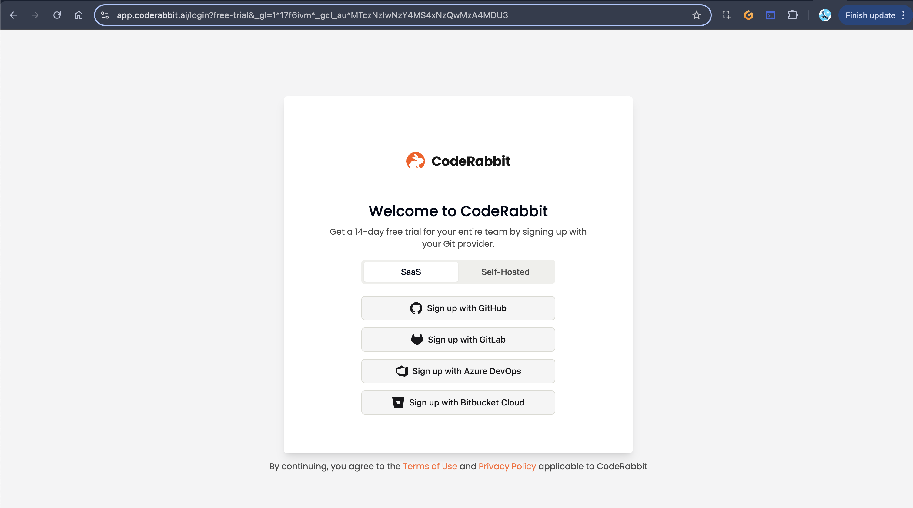

# Setting Up & Using Code Rabbit


<details>

<summary>

Here is our [full example](https://github.com/yaya2devops/free-genai-bootcamp-2025/pull/16).

</summary>


Pull Request 


</details>

## Account Creation
1. Navigate to Code Rabbit's website (https://coderabbit.ai)
2. Click "Get Started" in either the top right corner or the center of the page
3. Choose your sign-in method:
   - GitHub

   
   - GitLab
   - Azure DevOps
   - Bitbucket (in beta)
   - Self-hosted options (for GitHub Enterprise or GitLab)
4. For GitHub authentication:
   - Click "Sign up with GitHub"
   - Select the GitHub account you want to connect
   - Authorize Code Rabbit to have read/write access
   - Provide your email when prompted
5. Create or select an organization
   - Choose an existing organization or create a new one
   - Click "Continue"

## Free Trial & Pricing Details
1. **Free Trial Information**:
   - 14-day free trial of the Pro Plan
   - No credit card required
   - Two-click sign-up process
   
2. **Post-Trial Options**:
   - Free tier available (includes PR summarizations)
   - Pro Plan: $30/month per contributing developer
   - Monthly or annual billing options available
   - Easy to cancel at any time with no commitment

## Upgrading to Pro Plan if you want.
1. Navigate to "Subscription" in the left sidebar menu
2. Click "Get Started for Free" (no credit card required)
3. Select your currency (USD or Indian Rupees)
4. Choose the number of seats needed for your team ($30 per contributing developer)
5. Click "Proceed to Checkout"
6. Fill in your information:
   - First and last name
   - Company name (optional)
   - Billing address (optional during trial)
   - Email address
7. Click "Subscribe to Code Rabbit Pro Plan"
8. No credit card information is required for the 14-day trial


You will have this right pane with report disbaled.


Only by enrolling in the free tier should you have it unlocked. 

Do it, as I said no credit required.

You can verify you have it by clicking on subscription.


## Repository Setup
1. Click on "Repository" in the left sidebar
2. Ensure you've selected the correct organization in the top left dropdown
3. Select the specific repository you want to connect


   - You can authorize access to specific repositories rather than all repos

   

4. Authorize access:
   - You may need to confirm with GitHub mobile authentication
   - Complete your signup by confirming your primary email
   - Indicate how you heard about Code Rabbit (LinkedIn, referral, etc.)
5. After authorization, you'll see: "Congratulations! Code Rabbit is now installed on the repos you've chosen."


## Creating a Pull Request for Code Rabbit Review

Make sure you are pushing to the right repo. For instance if you are an org admin for GitHub and uses a child project, be sure to proceed on the child project in which you have coderabbit access to.

For me I will create a branch within my project and stage this content for that branch in which I will push to the main afterwards.

An issue for this already exists [here.](https://github.com/yaya2devops/free-genai-bootcamp-2025/issues/15)

1. Create a new branch:
   ```bash
   git checkout -b da-rabbit
   ```

3. Make your code changes

4. If you need to stash changes temporarily:
   ```bash
   git stash save "stay with me baby"
   ```

5. Create and switch to a new branch:
   ```bash
   git checkout -b da-rabbit
   ```

6. Apply your stashed changes:
   ```bash
   git stash apply
   ```

7. Add your changes:
   ```bash
   git add .
   ```

8. Commit your changes:
   ```bash
   git commit -m "#15 Senior Applied Rabbit PR Reviewer 🐇"
   ```

9. Push your branch to GitHub:
   ```bash
   git push
   ```
   - You may need to set the upstream branch on first push:
     ```bash
     git push --set-upstream origin da-rabbit
     ```

10. On GitHub:
    - Navigate to your repository
    - Click on "Pull Requests" tab
    - Click "New Pull Request"
    - Select your branch as the source
    - Select the main branch as the target (be careful to select the correct destination)
    - Click "Create Pull Request"
    - You don't need to add a description (Code Rabbit will generate one)

11. Wait for Code Rabbit to process your PR:
    - You'll see a message: "Currently processing new changes in the PR. This may take a few minutes."
    - Code Rabbit will analyze your changes and provide feedback

## Code Rabbit Features

### PR Summary
- Automatically generates descriptions for pull requests
- Includes:
  - New features added
  - Changes made to the codebase
  - Summary of file modifications

### Visual Diagrams
- Creates sequence diagrams to visualize code flows
- Shows relationships between functions and services
- Illustrates the execution pipeline

### Code Analysis
- Provides summaries of changed files
- Offers suggestions and tips for improvements
- May include creative elements (like poems about your code)

### Repository Configuration
1. Access by clicking on the repository name in the repository page
2. Available settings:
   - Review language: Choose your preferred language
   - Tone of instructions: Adjust the style of feedback
   - Enable/disable early features
   - Configure free tier features for non-paid users

### Learning System
- Code Rabbit learns from your codebase over time
- Stores insights to improve future reviews
- Adapts to your coding patterns and standards


### Integrations
- Jira: Connect with issue tracking
- Slack, Discord, Microsoft Teams: For notifications
- Email: For reports and summaries

## Reporting Features
1. Navigate to "Reports" in the sidebar
2. Report configuration options:
   - Date range: Select the period for the report
   - Report name: Give your report a title (e.g., "Example Report")
   - Grouping options:
     - Group by repository
     - Group by user
     - Group by team
     - Custom labels

3. Distribution channels:
   - Email
   - Slack
   - Discord
   - Microsoft Teams

4. Report types:
   - Daily stand-up reports
   - Developer activity summaries
   - Repository change logs

5. Report scheduling:
   - Generate on demand
   - Set up recurring reports

## Troubleshooting Tips
1. **Repository Not Visible**:
   - Ensure you've selected the correct organization in the top left dropdown
   - Verify that Code Rabbit has been granted access to the repository

2. **PR Review Not Starting**:
   - Check that you're creating the PR in the correct repository
   - Verify that the source and destination branches are correct
   - Ensure Code Rabbit has proper permissions

3. **Conflicting Extensions**:
   - Some browser extensions might interfere with Code Rabbit (like Netlify)
   - Try disabling other GitHub-related extensions if issues occur

4. **Self-Reviewer Issues**:
   - Code Rabbit works even when you're both the PR creator and reviewer
   - No need to add additional reviewers to trigger Code Rabbit

## Best Practices
1. Use Code Rabbit with multiple developers to maximize value
2. Set up daily stand-up reports for team management
3. Review Code Rabbit's suggestions to improve code quality
4. Leverage the learning system by maintaining consistent PR practices
5. Use the grouping features in reports to focus on specific teams or repositories

## Additional Notes
- Code Rabbit works across repositories in your organization
- The system becomes more valuable over time as it learns your codebase
- Reports are especially useful for managers and CTOs to track developer activity
- The free tier provides ongoing PR summarization even after your trial ends


> So and this is where the report feature comes into play late.

You can set it up to get expanded insights based on what you pulling on requests.


There is also configuration under the repo assigned so you can customize the output even more.
