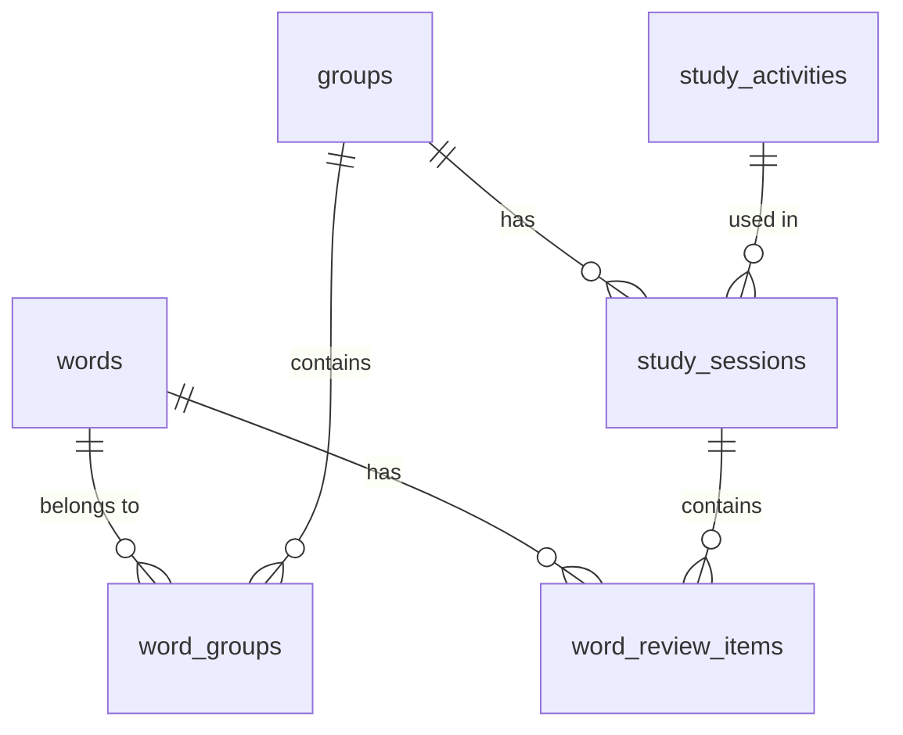

# Database Schema and Relationships

## Overview
The database schema is designed to support a language learning system with vocabulary management, study groups, and learning progress tracking. The system uses SQLite3 as the database engine and follows standard relational database design principles.

## Tables

### words
Stores the core vocabulary data.
```sql
CREATE TABLE words (
    id INTEGER PRIMARY KEY AUTOINCREMENT,
    japanese TEXT NOT NULL,
    romaji TEXT NOT NULL,
    english TEXT NOT NULL,
    parts JSON NOT NULL
);
```
- Primary repository for vocabulary words
- `parts` column uses JSON to store flexible word component data
- Each word can belong to multiple groups through the word_groups join table

### groups
Manages collections of words for study purposes.
```sql
CREATE TABLE groups (
    id INTEGER PRIMARY KEY AUTOINCREMENT,
    name TEXT NOT NULL,
    words_count INTEGER DEFAULT 0
);
```
- Organizes words into logical study units
- `words_count` serves as a counter cache for performance optimization
- Related to words through word_groups join table
- Can have multiple study sessions

### word_groups
Join table implementing many-to-many relationship between words and groups.
```sql
CREATE TABLE word_groups (
    id INTEGER PRIMARY KEY AUTOINCREMENT,
    word_id INTEGER NOT NULL,
    group_id INTEGER NOT NULL,
    FOREIGN KEY (word_id) REFERENCES words(id) ON DELETE CASCADE,
    FOREIGN KEY (group_id) REFERENCES groups(id) ON DELETE CASCADE
);
```
- Enables flexible word organization
- Includes foreign key constraints for referential integrity
- One word can belong to multiple groups
- One group can contain multiple words

### study_activities
Defines types of learning exercises available in the system.
```sql
CREATE TABLE study_activities (
    id INTEGER PRIMARY KEY AUTOINCREMENT,
    name TEXT NOT NULL,
    url TEXT NOT NULL
);
```
- Maintains catalog of available learning exercises
- URL field points to the actual learning application
- Each activity can be used in multiple study sessions

### study_sessions
Records individual learning sessions.
```sql
CREATE TABLE study_sessions (
    id INTEGER PRIMARY KEY AUTOINCREMENT,
    group_id INTEGER NOT NULL,
    study_activity_id INTEGER NOT NULL,
    created_at TIMESTAMP DEFAULT CURRENT_TIMESTAMP,
    FOREIGN KEY (group_id) REFERENCES groups(id) ON DELETE CASCADE,
    FOREIGN KEY (study_activity_id) REFERENCES study_activities(id) ON DELETE CASCADE
);
```
- Tracks when and how words are studied
- Links groups with study activities
- Contains timestamp for study progression tracking
- One session belongs to one group and one activity

### word_review_items
Tracks individual word review attempts during study sessions.
```sql
CREATE TABLE word_review_items (
    id INTEGER PRIMARY KEY AUTOINCREMENT,
    word_id INTEGER NOT NULL,
    study_session_id INTEGER NOT NULL,
    correct BOOLEAN NOT NULL,
    created_at TIMESTAMP DEFAULT CURRENT_TIMESTAMP,
    FOREIGN KEY (word_id) REFERENCES words(id) ON DELETE CASCADE,
    FOREIGN KEY (study_session_id) REFERENCES study_sessions(id) ON DELETE CASCADE
);
```
- Records success/failure for each word review
- Enables progress tracking and statistics
- Timestamps allow for temporal analysis
- Each review belongs to one word and one session

## Key Relationships

1. Words ←→ Groups (Many-to-Many)
   - Implemented through word_groups join table
   - Allows flexible organization of vocabulary
   - Enables targeted study sessions

2. Groups → Study Sessions (One-to-Many)
   - Each study session focuses on one group
   - Groups can have multiple study sessions
   - Helps track progress within specific vocabulary sets

3. Study Activities → Study Sessions (One-to-Many)
   - Study sessions use specific activity types
   - Activities can be reused across multiple sessions
   - Enables activity-specific analysis

4. Study Sessions → Word Review Items (One-to-Many)
   - Sessions contain multiple word reviews
   - Reviews track individual word practice
   - Enables detailed progress tracking

5. Words → Word Review Items (One-to-Many)
   - Words can be reviewed multiple times
   - Reviews track mastery progression
   - Enables word-specific difficulty analysis

## Design Considerations

### Performance Optimization
1. Counter Cache
   - `groups.words_count` maintains pre-calculated word counts
   - Reduces need for COUNT queries
   - Updated automatically through triggers

2. Indexing Strategy
   - Foreign key columns are indexed
   - Commonly queried fields (created_at, correct) are indexed
   - Composite indexes for frequent join patterns

### Data Integrity
1. Foreign Key Constraints
   - Enforces referential integrity
   - Cascade deletes where appropriate
   - Prevents orphaned records

2. Required Fields
   - NOT NULL constraints on essential data
   - Default values for optional fields
   - Timestamp defaults for tracking fields

### Flexibility
1. JSON Storage
   - `words.parts` allows flexible word component storage
   - Accommodates varying word structures
   - Enables future expansion without schema changes

2. Activity System
   - Generic activity structure
   - URL-based activity launching
   - Supports addition of new activity types

### Scalability Considerations
1. Denormalization
   - Counter cache reduces join complexity
   - Stored calculated values where beneficial
   - Balances normalization with performance

2. Pagination Support
   - All list endpoints support pagination
   - Prevents memory issues with large datasets
   - Enables efficient client-side rendering

## Schema Diagram

