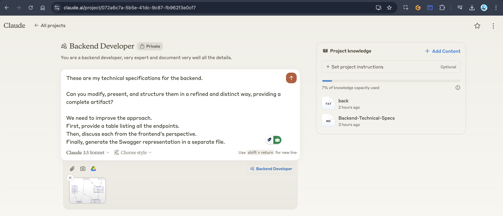

```
These are my technical specifications for the backend. 

Can you modify, present, and structure them in a refined and distinct way, providing a complete artifact?

We need to improve the approach.

First, provide a table listing all the endpoints. 

Then, discuss each from the frontend’s perspective. 

Finally, generate the Swagger representation in a separate file.
```



- [200 - Doc](docs.md)
- [Initial Specs](Backend-Technical-Specs.md)
- [Database Schema]()

