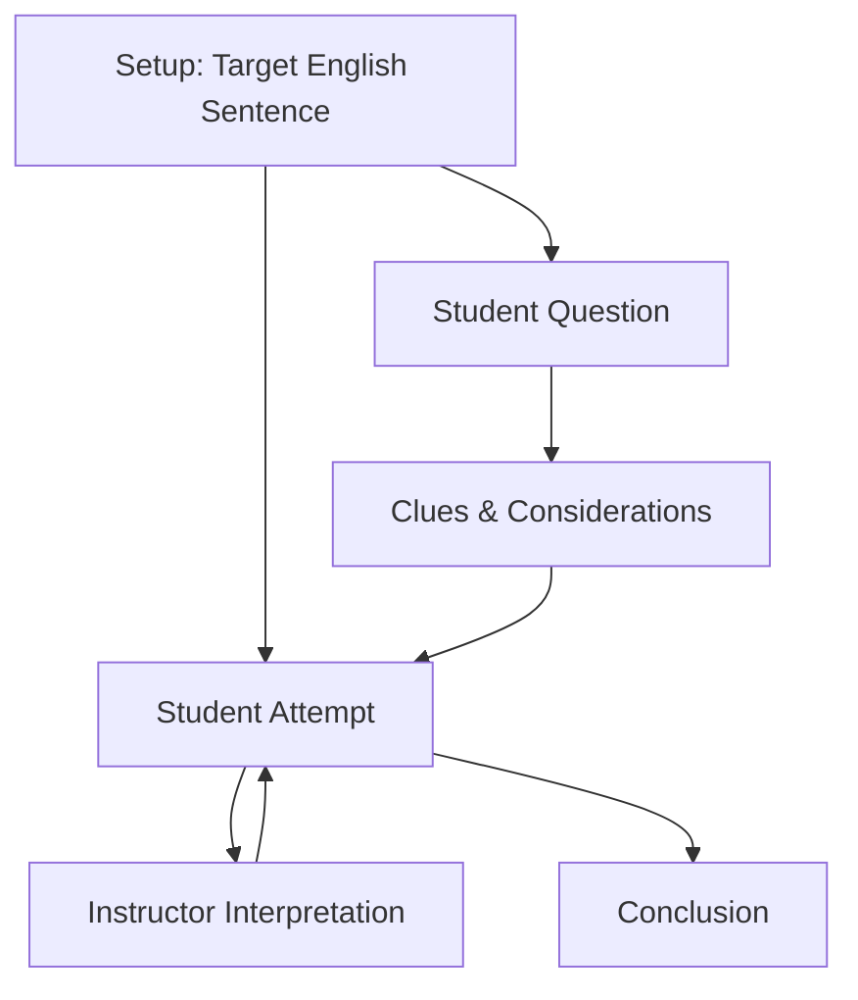

# ClaudeTunes AI

Tunisia Arabic, locally known as (الدارجة) or Tounsi (توسي) and where I happened to be born and speak most of living life, evolved from the dialectal Arabic brought by Muslim conquests in the 7th century CE What makes Tunisian Arabic unique is its rich linguistic tapestry, shaped by centuries of cultural exchange and historical influences.

- [Access](prompt.md)
 prompt.
- [Access](examples.xml)
 Examples.
- [Access](considerations-examples.xml)
 Considerations.
- [Access](sentence-structure-examples.xml)
 Teaching Structure.
 

 Do [Access](state.md) State as well.


### Project Structure

Anthropic have [very specific suggestions](https://docs.anthropic.com/en/docs/build-with-claude/prompt-engineering/use-xml-tags
) for providing good prompting.

```
project_root/
├── claude/
│   ├── prompt.md
│   ├── examples.xml
│   ├── sentence_structure_examples.xml
│   └── README.md
```

### Model Selection
- Claude 3.5 Sonnet (2025 Q1)
- Paid version capabilities
- Project feature support
- XML-based interactions

## Implementation Components

### State Flow Architecture



### Component Breakdown

| State | Purpose | Content Type |
|-------|---------|--------------|
| Setup | Initial scenario | Vocabulary, Structure, Guidelines |
| Attempt | Student translation | Japanese sentence |
| Question | Clarification request | Student inquiry |
| Interpretation | Teacher feedback | Analysis, Guidance |
| Clues | Additional help | Contextual assistance |
| Conclusion | Final assessment | Completion confirmation |

## Document Organization

### Core Components
1. Main Prompt:
   - Role definition
   - Language level
   - Teaching instructions
   - State management

2. Examples File:
   - Good examples
   - Bad examples
   - Scoring rationale
   - Implementation patterns

3. Sentence Structure:
   - Pattern examples
   - Formation guidelines
   - Level-appropriate constructs
   - Usage contexts

## Implementation Patterns

### Setup State
```xml
<setup>
    <vocabulary_table>
        <entry>
            <japanese>カラス</japanese>
            <romaji>karasu</romaji>
            <english>raven</english>
        </entry>
    </vocabulary_table>
    <sentence_structure>
        <!-- Structure guidelines -->
    </sentence_structure>
    <initial_guidelines>
        <!-- Teaching approach -->
    </initial_guidelines>
</setup>
```

### Attempt Processing
```xml
<attempt_response>
    <interpretation>
        <!-- Sentence breakdown -->
    </interpretation>
    <feedback>
        <!-- Constructive guidance -->
    </feedback>
    <next_steps>
        <!-- Improvement suggestions -->
    </next_steps>
</attempt_response>
```

## Key Implementation Features

### 1. XML Integration
- Clear structure delineation
- Consistent formatting
- Easy parsing
- State management support

### 2. File Separation
- Modular components
- Focused content
- Easier maintenance
- Clear organization

### 3. State Management
- Clear flow definition
- Predictable responses
- Structured interaction
- Progressive learning

## Best Practices

### Document Organization
1. Separation of Concerns:
   - Core prompt isolation
   - Example categorization
   - State-specific content
   - Clear dependencies

2. File Management:
   - Logical grouping
   - Version control
   - Clear naming
   - Organized structure

### Implementation Strategy
1. State Control:
   - Clear state definitions
   - Transition rules
   - Response patterns
   - Progress tracking

2. Content Management:
   - Level-appropriate material
   - Consistent formatting
   - Clear guidance
   - Progressive difficulty

## Conclusion

The Claude implementation of the Japanese Sentence Constructor demonstrates the importance of structured state management and clear component organization. By breaking down the interaction into distinct states and organizing content into separate, focused files, we create a more maintainable and effective teaching tool. The use of XML formatting and clear state transitions helps ensure consistent, predictable behavior while maintaining flexibility for different learning paths.

Key success factors include:
- Clear state definitions and transitions
- Organized file structure
- XML-based formatting
- Progressive learning support
- Modular component design

The implementation shows that proper structure and state management can significantly improve the effectiveness of AI-powered language teaching tools, providing a more focused and productive learning experience for students.