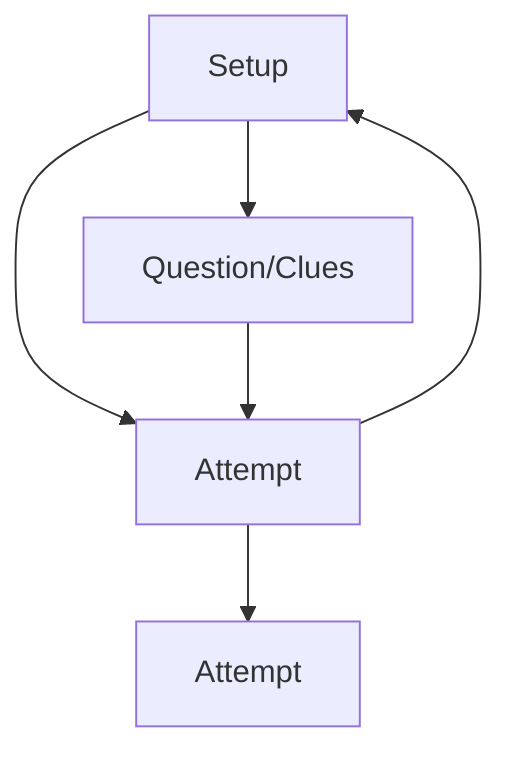

# Claude!  

This is State Management!

## State Flow Architecture

### Core States Definition


### State Components

| State | Input | Output |
|-------|--------|---------|
| Setup | Target English sentence | - Vocabulary table<br>- Sentence structure<br>- Clues/considerations<br>- Next steps |
| Attempt | Japanese sentence attempt | - Interpretation<br>- Feedback<br>- Guidance |
| Clues | Student question | - Specific guidance<br>- Examples<br>- Explanations |

## Implementation Structure

### Document Organization
```
project_structure/
├── prompt.md
├── examples.xml
├── sentence_structure_examples.xml
├── considerations_examples.xml
└── testing_scenarios.md
```

### State Transition Rules
1. Setup State:
   - Entry point for new sentences
   - Can transition to Attempt or Clues
   - Triggered by English input

2. Attempt State:
   - Processes Japanese translations
   - Can cycle back to itself
   - Can return to Setup
   - Triggered by Japanese text

3. Clues State:
   - Handles questions
   - Returns to Attempt
   - Triggered by questions

## Component Specifications

### Vocabulary Table Structure
```xml
<vocabulary>
    <entry>
        <japanese>寒い</japanese>
        <romaji>samui</romaji>
        <english>cold</english>
    </entry>
</vocabulary>
```

### Response Components
1. Setup Output:
   - Structured vocabulary
   - Clear sentence patterns
   - Focused guidance
   - Progressive steps

2. Attempt Output:
   - Interpretation
   - Targeted feedback
   - Next steps
   - Error correction

3. Clues Output:
   - Specific guidance
   - Relevant examples
   - Clear explanations
   - Progressive hints

## Model Behavior Testing

### Testing Strategies
1. Cross-Model Testing:
   - Claude Opus
   - Claude Sonnet
   - Claude Haiku
   - Performance comparison

2. Edge Case Testing:
   - Complex sentences
   - Multiple clauses
   - Irregular patterns
   - Error conditions

### Model Optimization
1. Example Enhancement:
   ```xml
   <examples>
       <good_example score="10">
           <reason>Concise, clear guidance</reason>
           <content>...</content>
       </good_example>
       <bad_example score="6">
           <reason>Too verbose, unfocused</reason>
           <content>...</content>
       </bad_example>
   </examples>
   ```

2. Performance Tuning:
   - Example variation
   - Context optimization
   - State clarity
   - Response formatting

## Implementation Refinements

### Quality Checks
1. Pre-Response Validation:
   - Column count verification
   - Structure adherence
   - State consistency
   - Format compliance

2. Content Verification:
   ```markdown
   - Read all example files
   - Verify vocabulary format
   - Check sentence structure
   - Confirm state alignment
   ```

### Performance Optimization
1. Size Considerations:
   - Context window management
   - Example distribution
   - State transition clarity
   - Response formatting

2. Model-Specific Adjustments:
   - Haiku simplification
   - Response structure
   - Example clarity
   - State indicators

## Testing Framework

### Test Cases
1. Basic Scenarios:
   ```markdown
   - Simple sentences
   - Common patterns
   - Basic vocabulary
   - Clear states
   ```

2. Complex Cases:
   ```markdown
   - Multiple clauses
   - Time expressions
   - Location markers
   - State transitions
   ```

### Quality Assurance
1. Response Validation:
   - Format consistency
   - State clarity
   - Guidance appropriacy
   - Example relevance

2. Performance Metrics:
   - Response accuracy
   - State consistency
   - Guidance quality
   - Learning progression

## Conclusion

The implementation of state management in the Japanese Sentence Constructor demonstrates the importance of clear state definitions, structured transitions, and comprehensive testing. The system's effectiveness depends on:

1. Clear Component Organization:
   - Well-defined states
   - Structured transitions
   - Consistent formats
   - Quality validation

2. Model Optimization:
   - Example variety
   - Context management
   - Response formatting
   - Performance tuning

3. Quality Assurance:
   - Comprehensive testing
   - Format verification
   - State validation
   - Content review

Success depends on balancing complexity with clarity, ensuring consistent behavior across different model sizes while maintaining effective language teaching capabilities. The system's modular design and clear state management enable efficient evolution and maintenance over time.