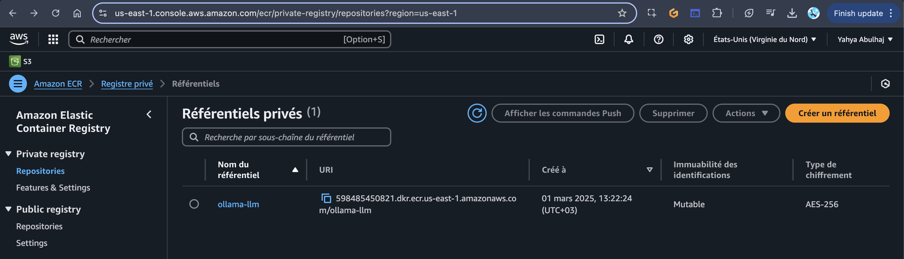

# oLLaMA 8 Billion on Lambda

This report analyzes a tutorial demonstrating a creative approach to deploy oLLaMA (open source language models) on AWS Lambda, despite its memory limitations. 

Start with the [issue of this implementation](https://github.com/yaya2devops/free-genai-bootcamp-2025/issues/14).

1. Get [this script](gloryah-deploy.sh) locally.
2. Run it and go AWS to find your CFN template.
3. Apply your template.

Make sure it is same directory as the script. Also make sure to authenticate with AWS across access ID, its secret as well as the region. Without region it won't pass.



Done.

> Need help with CFN? I [got you](https://docs.awsboot.com/iac/cfn) with a bucket.

The method leverages AWS Lambda's ephemeral storage and maximum memory allocations to run smaller, distilled language models cost-effectively in a serverless environment.

The memory size is set to 10240. Too high. Change it to 3008. Valid (Max Allowed)

Delete the stack:

```sh
aws cloudformation delete-stack --stack-name OllamaLambdaStack
```

Redploy and see.


Check out the script output for [CFN validation](yahxgloryah.md)

## Observation

The minute it is run it pulls it cause it is not present in the docker image:


Rerun the test and check the logs of the flow.


Find [here](log-events-viewer-result.csv) Gloryah deepseek model running with Olama on AWS Lambda.

### Key Components

1. **Model Selection**
   - Uses distilled LLMs from oLLaMA that fit within Lambda's 10GB memory limit
   - Successfully deployed DeepSeek-Coder R1 (8B parameter model)

2. **Technical Implementation**
   - Maximizes Lambda's resource limits (memory and ephemeral storage)
   - Changes model path to use Lambda's ephemeral storage
   - Uses AWS Lambda Runtime Interface Client to create an HTTP server inside Lambda
   - Implements a background process to run the oLLaMA server while Lambda handles requests

3. **Deployment Process**
   - Containerized solution using Docker
   - Infrastructure-as-code implementation with CloudFormation
   - Automated deployment script for ECR repository and Lambda function setup


   

4. **Performance Considerations**
   - First invocation experiences cold start while pulling the model
   - Subsequent invocations are faster as the model is already loaded
   - Suggests strategies like provisioned concurrency to minimize cold starts

5. **Limitations & Current State**
   - No implementation of Lambda response streaming (though possible)
   - Lacks conversation memory/history (could be implemented with DynamoDB)
   - Alternative models could be tested (Llama, Mistral, Gemma)

6. **Important Disclaimer**
   - The author emphasizes this is an experimental approach, not an official AWS architecture recommendation
   - For production use, managed solutions like Amazon SageMaker or Bedrock would be more appropriate

## Architecture Overview


## Potential Development Roadmap

### 1. Model Optimization Techniques
- Implement quantization techniques to further reduce model size and memory footprint
- Explore model pruning to remove unnecessary parameters
- Test model compilation tools to optimize for Lambda's execution environment
- Benchmark different distilled models to find optimal performance/size ratio

### 2. Enhanced Architecture Options
- Implement a hybrid approach using Lambda for quick responses and SageMaker for more complex, memory-intensive tasks
- Create a multi-model endpoint that can switch between different specialized models based on query type
- Add a caching layer (e.g., ElastiCache) for frequently requested responses
- Develop a distributed approach using multiple Lambda functions for larger models

### 3. Performance Improvements
- Implement the suggested Lambda response streaming for more responsive user experience
- Create a warm-up strategy using CloudWatch Events to periodically invoke the function
- Use Lambda SnapStart with Java runtime for faster initializations (if applicable)
- Optimize container image size to reduce cold start time

### 4. Production-Ready Features
- Add conversation history using DynamoDB to maintain stateful interactions
- Implement comprehensive logging and monitoring with CloudWatch
- Create fallback mechanisms for when memory limits are approached
- Add A/B testing capability to compare different models' performance
- Implement robust error handling and automatic recovery

### 5. Security Enhancements
- Implement input validation and sanitization to prevent prompt injection
- Add rate limiting to prevent abuse
- Implement VPC integration for more secure deployments
- Create fine-grained IAM permissions
- Add encryption for sensitive data at rest and in transit

### 6. Cost Optimization
- Implement auto-scaling based on usage patterns
- Create a usage dashboard to monitor costs
- Test different memory configurations to find optimal cost/performance ratio
- Develop strategies for handling traffic spikes efficiently

### 7. Integration Capabilities
- Create API Gateway integration with authentication
- Build webhook capabilities for third-party service integration
- Develop plugins for popular platforms (Slack, Discord, etc.)
- Implement streaming response functionality

### 8. Advanced Features
- Add fine-tuning capabilities for custom use cases
- Implement prompt engineering techniques
- Create function calling capabilities
- Build tool use functionality
- Develop specialized versions for different domains (code, chat, etc.)

## That is it

This experimental approach demonstrates the flexibility of AWS Lambda for AI workloads and could serve as a foundation for cost-effective, serverless AI applications that don't require the full capabilities of managed AI services. While not recommended for critical production systems, it represents an innovative solution for development environments, personal projects, or scenarios with limited budget but significant computational needs.

The ability to run open source LLMs in a serverless environment opens up possibilities for developers to experiment with AI capabilities without significant infrastructure investment, potentially accelerating innovation in the field of practical AI applications.